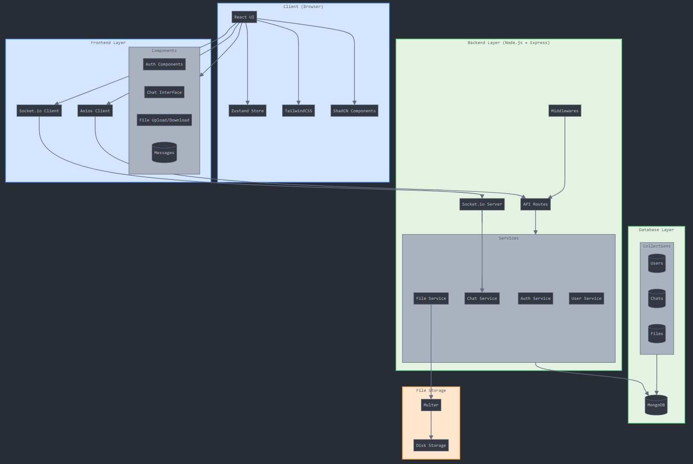

# rogerROGER

Frontend: Built with React 
UI Components: ShadCN 
Styling: Tailwind CSS 
Responsiveness: Fully Responsive Design 
Authentication: JWT Tokens 
File Handling: Multer for File and Image Storage 
File Download: Easy File Downloading 
Real-time Messaging: Sockets for Instant Communication 
Chat Support: Group Chats and Personal Messages 
Fun Conversations: Emoji Support 
Backend: Node.js and Express 
Database: MongoDB for Efficient Data Storage 
State Management: Zustand for Seamless State Management 
API Calls: Axios for Smooth API Interactions 
Code Quality: Structured and Maintainable Code 

Features to come: 
- Blocking (+ block list, mass block, ...) 
- Save transcript of chat / groupchat 
- Day/Night mode 
